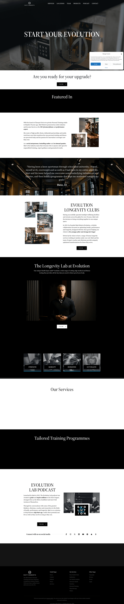

# DESIGN.md: Matt Roberts Evolution

## Source
- URL: https://mattroberts.co.uk/
- Capture date: 2026-09-19
- Evidence: Firecrawl `branding` + `markdown` + `html` scrape, Firecrawl `screenshot@fullPage` (downloaded locally)

## Reference Screenshot

Use this screenshot as the visual source of truth for layout, hierarchy, density, and feel — it overrides the scraped color tokens below where they disagree (see note under Colors).

## Design Summary
Premium private-personal-training studio (Mayfair, London). Editorial, magazine-quality, black/white, serif-led — closer to a luxury hospitality or wellness-clinic site than a "gym template." Long vertical narrative built from alternating full-bleed black bands and white bands, each holding one idea (founder story, client testimonial, "Longevity Lab," services, programmes, podcast). Photography is moody, desaturated, editorial (studio interiors, founder portrait in dark turtleneck against dark backdrop) — never stock-bright. CTAs are small, quiet, sharp-cornered black pills with a right-arrow, never oversized or shouting. This is the "premium/quiet confidence" end of the spectrum vs. our own athletic/motion-forward direction — useful as a counter-reference for restraint and typographic authority.

## Design Tokens

### Colors
Scraped `colors` block returned generic WordPress/Elementor theme defaults (`primary:#1E73BE` blue, `secondary:#FF8000` orange) that **do not appear anywhere in the actual rendered page** (confirmed against screenshot) — flagged low-confidence/inferred-wrong, discard them. Observed from screenshot instead (high confidence):
- Ink black: `#000000` (full-bleed dark section backgrounds, primary CTA fill)
- Paper white: `#FFFFFF` (light section backgrounds)
- Body text on dark: warm off-white, ~`#F2F0EB` (inferred, not pure white — softened over photography)
- No accent color at all — zero saturated hue anywhere on the page. Confidence is carried entirely by black/white contrast + photography, not color.

### Typography
- Heading: **"The Seasons Bold"** (scraped, confidence 0.9) — a serif display face, large and light-tracked, used for section titles ("EVOLUTION LONGEVITY CLUBS", "START YOUR EVOLUTION"). Scraped sizes: H1 `112px`, H2 `70px`.
- Body: **Source Serif 4** (scraped) — serif body copy, `22px`, generously leaded. Notably: body text is serif too, not a sans pairing — reinforces the editorial/publishing feel over "tech/SaaS."
- No condensed/athletic display face anywhere — opposite end of the spectrum from our Bebas Neue / Space Mono choices.

### Spacing And Layout
- Base spacing unit: `4px` (scraped), overall border-radius default `5px` (theme-level, mostly unused visually).
- Buttons: primary CTA observed in screenshot is a **sharp-cornered black pill** (`buttonSecondary` in scrape data: `background:#000000, borderRadius:0px` — this matches the screenshot; the rounded blue "buttonPrimary" in scrape data does not appear anywhere and should be discarded same as the color tokens).
- Section rhythm: full-bleed alternating black/white bands, generous vertical padding (visually ~120-160px per section), centered single-column text blocks for statements, asymmetric two-column for story/testimonial sections.

## Components
- **Nav**: minimal centered-logo top bar, thin uppercase text links (SERVICES / LOCATIONS / TEAM / PRODUCTS / PODCAST / CONTACT), no visible CTA button in the bar itself.
- **CTA button**: small, sharp-cornered, black fill, white uppercase label + right-chevron, e.g. "ENQUIRE →". Never large or high-contrast-colored — confidence comes from restraint, not size.
- **Hero**: full-bleed dark/desaturated photo, large serif headline centered-left, no subhead paragraph, no visible primary CTA in the hero itself (CTA appears in the section directly below — "Are you ready for your upgrade?" + one button).
- **Story/testimonial block**: asymmetric photo collage (3 overlapping images at different sizes) beside a serif pull-quote in italic, attribution below.
- **Feature strip**: 4 square thumbnail tiles with single-word labels (STRENGTH / MOBILITY / HORMONES / GUT HEALTH) under a full-bleed dark portrait section — restrained, not a card grid.
- **Podcast/media block**: two-column, photo + episode art on one side, copy + CTA on the other.
- **Footer**: full-bleed black, 4-column link list under logo + social icons row.

## Page Patterns
Section order: Hero → soft CTA prompt → "Featured In" press strip (dark) → Founder story (photo collage + bio) → Client testimonial (full-bleed dark, photo background) → Program intro (photo collage + copy) → "Longevity Lab" feature (full-bleed dark, founder portrait + 4-tile strip) → Services (placeholder-heavy on this crawl) → Tailored Programmes (dark band) → Podcast → Footer.
Responsive assumptions not verifiable from a single desktop scrape — flagged as inferred: given generous whitespace and large type, this pattern likely still works down to tablet width with the two-column sections stacking; below ~480px the 112px H1 would need a fluid clamp() to avoid overflow.

## Content Style
Voice: confident, credential-forward ("Europe's first private Personal Training studio," "more than a million hours delivered"), third-person founder narrative rather than first-person coach voice. CTA copy is terse and uniform: "ENQUIRE →", "EXPLORE →" — one verb, one arrow, repeated everywhere rather than varied per section. Headings are short declarative statements ("Are you ready for your upgrade?"), not questions-as-hooks or motivational quotes.

## Agent Build Instructions
To borrow from this reference for a build (not to copy it) — apply *principles*, not literal values, and only where they don't conflict with an existing brand direction:
1. If restraint/luxury is the goal: drop all accent color, rely purely on black/white + photography contrast for "premium" signal.
2. Use one uniform CTA microcopy pattern site-wide ("VERB →") instead of varying copy per button — repetition reads as brand discipline here.
3. Consider a serif body face (not just serif headings) if the target feel is "editorial/clinical authority" rather than "athletic/energetic" — this is the opposite lever from our lime/Bebas Neue direction and should only be borrowed if that's a deliberate pivot, not a default.
4. Alternate full-bleed black/white section bands for rhythm instead of a single background color for the whole page.
5. Do NOT reuse the scraped `colors` or `buttonPrimary` tokens verbatim — they're theme defaults invisible in the actual rendered design; always cross-check scraped tokens against the screenshot before trusting them.

## Rerun Inputs
workflow: firecrawl-website-design-clone
source_url: https://mattroberts.co.uk/
target_stack: Next.js App Router / Tailwind CSS v4 / shadcn/ui / Motion
output: DESIGN.md
